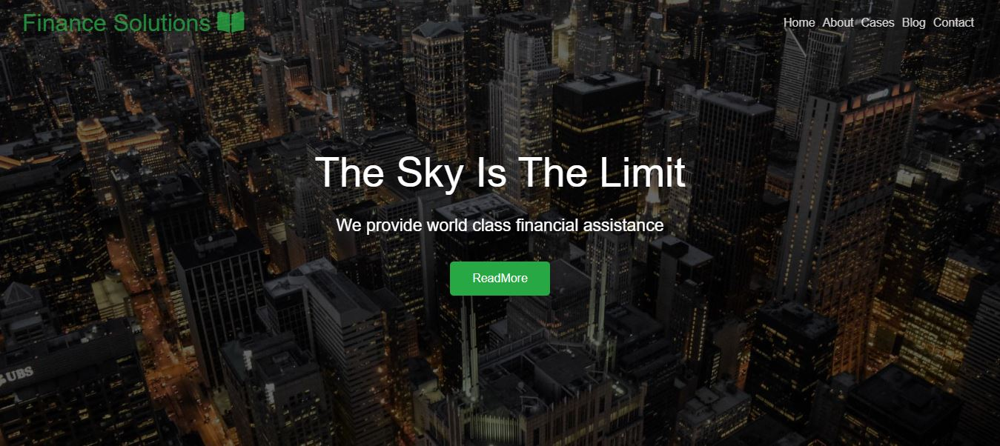

# Finance Solutions Website

Welcome to the Finance Solutions website repository! This project is a responsive, multi-section website designed for a financial services company. The website includes sections for Home, About, Cases, Blog, Team, and Contact.

## Table of Contents

- [Project Overview](#project-overview)
- [Features](#features)
- [Technologies Used](#technologies-used)
- [Setup and Installation](#setup-and-installation)
- [Usage](#usage)
- [Contributing](#contributing)
- [License](#license)
- [Contact](#contact)

## Project Overview

The Finance Solutions website aims to provide a professional and modern web presence for a financial services company. The site features smooth navigation, responsive design, and informative sections about the company's services, case studies, blog posts, and team members.

## Features

- **Responsive Design**: Ensures the website looks great on all devices.
- **Smooth Scrolling Navigation**: Navigation links smoothly scroll to the corresponding sections.
- **Multi-Section Layout**: Includes Home, About, Cases, Blog, Team, and Contact sections.
- **Interactive Elements**: Buttons and links with hover effects and smooth transitions.
- **Font Awesome Icons**: Used for intuitive and attractive iconography.

## Technologies Used

- **HTML5**: For structuring the content.
- **CSS3**: For styling the website.
- **JavaScript**: For interactive elements and smooth scrolling.
- **Font Awesome**: For icons.
- **Responsive Design Techniques**: Ensures the site is mobile-friendly.
